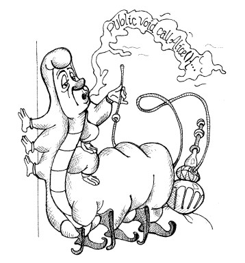

# Chapter 3: Functions

- [Home](../index.md)
- [Table of Contents](../SUMMARY.md)
- [Chapter 3 index](README.md)

<p align="center">
  
</p>

Functions are the first line of organization in a program. This chapter is about writing functions that are easy to read, easy to test, and easy to change.

## A refactoring story (FitNesse example)

The chapter starts with a long, messy function that mixes too many concerns: duplicated logic, strange strings, nested conditionals, and multiple levels of abstraction.

### Listing 3-1 (original)

```java
// HtmlUtil.java (FitNesse 20070619)
public static String testableHtml(
  PageData pageData,
  boolean includeSuiteSetup
) throws Exception {
  WikiPage wikiPage = pageData.getWikiPage();
  StringBuffer buffer = new StringBuffer();
  if (pageData.hasAttribute("Test")) {
    if (includeSuiteSetup) {
      WikiPage suiteSetup =
        PageCrawlerImpl.getInheritedPage(
          SuiteResponder.SUITE_SETUP_NAME, wikiPage
        );
      if (suiteSetup != null) {
        WikiPagePath pagePath =
          suiteSetup.getPageCrawler().getFullPath(suiteSetup);
        String pagePathName = PathParser.render(pagePath);
        buffer.append("!include -setup .")
          .append(pagePathName)
          .append("\n");
      }
    }
    WikiPage setup =
      PageCrawlerImpl.getInheritedPage("SetUp", wikiPage);
    if (setup != null) {
      WikiPagePath setupPath =
        wikiPage.getPageCrawler().getFullPath(setup);
      String setupPathName = PathParser.render(setupPath);
      buffer.append("!include -setup .")
        .append(setupPathName)
        .append("\n");
    }
  }
  buffer.append(pageData.getContent());
  if (pageData.hasAttribute("Test")) {
    WikiPage teardown =
      PageCrawlerImpl.getInheritedPage("TearDown", wikiPage);
    if (teardown != null) {
      WikiPagePath tearDownPath =
        wikiPage.getPageCrawler().getFullPath(teardown);
      String tearDownPathName = PathParser.render(tearDownPath);
      buffer.append("\n")
        .append("!include -teardown .")
        .append(tearDownPathName)
        .append("\n");
    }
    if (includeSuiteSetup) {
      WikiPage suiteTeardown =
        PageCrawlerImpl.getInheritedPage(
          SuiteResponder.SUITE_TEARDOWN_NAME,
          wikiPage
        );
      if (suiteTeardown != null) {
        WikiPagePath pagePath =
          suiteTeardown.getPageCrawler().getFullPath(suiteTeardown);
        String pagePathName = PathParser.render(pagePath);
        buffer.append("!include -teardown .")
          .append(pagePathName)
          .append("\n");
      }
    }
  }
  pageData.setContent(buffer.toString());
  return pageData.getHtml();
}
```

With extractions, renaming, and restructuring, the intent becomes obvious.

### Listing 3-2 (refactored)

```java
// HtmlUtil.java (refactored)
public static String renderPageWithSetupsAndTeardowns(
  PageData pageData, boolean isSuite
) throws Exception {
  boolean isTestPage = pageData.hasAttribute("Test");
  if (isTestPage) {
    WikiPage testPage = pageData.getWikiPage();
    StringBuffer newPageContent = new StringBuffer();
    includeSetupPages(testPage, newPageContent, isSuite);
    newPageContent.append(pageData.getContent());
    includeTeardownPages(testPage, newPageContent, isSuite);
    pageData.setContent(newPageContent.toString());
  }
  return pageData.getHtml();
}
```

The point is not that you understand every FitNesse detail. The point is that the second version quickly tells you what kind of work is happening, and why.

## Small functions

The first rule is: functions should be small. The second rule is: they should be smaller than that.

Small functions are easier to name, easier to test, easier to reuse, and easier to keep at one level of abstraction. Deep nesting and long blocks are a sign the function is doing too much.

## Do one thing

Functions should do one thing, do it well, and do it only.

“One thing” becomes clearer when you think in levels of abstraction. A function is doing one thing when its steps are all at the same level, one step below the function’s name.

### Listing 3-3 (re-refactored)

```java
// HtmlUtil.java (re-refactored)
public static String renderPageWithSetupsAndTeardowns(
  PageData pageData, boolean isSuite) throws Exception {
  if (isTestPage(pageData))
    includeSetupAndTeardownPages(pageData, isSuite);
  return pageData.getHtml();
}
```

Two simple “smell checks” from the chapter:
- If you can split a function into named “sections” (declarations, init, algorithm, etc.), it is probably doing more than one thing.
- If you can extract a function whose name is not just a restatement of the original code, then the original was doing more than one thing.

## Blocks and indenting

Keep blocks small, ideally one line that calls another function. This keeps the top-level function short and gives the block a descriptive name.

If nesting gets deep, the function is too big. The chapter suggests keeping indentation to one or two levels.

## One level of abstraction per function

Mixing high-level intent with low-level details is confusing. When a function mixes concepts like “render HTML” with details like `append(\"\\n\")`, readers get bounced between levels.

## Read top-down (the Stepdown Rule)

Code should read like a top-down story. A function at one level should be followed by functions at the next level down. You should be able to read the file like a series of “TO paragraphs,” going one level deeper as you read.

## Switch statements

Switch statements are hard to keep small and they almost always do N things. They also tend to spread, because many other operations end up needing the same switch.

The chapter’s recommendation is to hide the switch behind polymorphism and keep it in one place (often inside a factory).

### Listing 3-4 (problem)

```java
// Payroll.java
public Money calculatePay(Employee e)
throws InvalidEmployeeType {
  switch (e.type) {
    case COMMISSIONED:
      return calculateCommissionedPay(e);
    case HOURLY:
      return calculateHourlyPay(e);
    case SALARIED:
      return calculateSalariedPay(e);
    default:
      throw new InvalidEmployeeType(e.type);
  }
}
```

### Listing 3-5 (hide switch in a factory)

```java
// Employee and Factory
public abstract class Employee {
  public abstract boolean isPayday();
  public abstract Money calculatePay();
  public abstract void deliverPay(Money pay);
}
-----------------
public interface EmployeeFactory {
  public Employee makeEmployee(EmployeeRecord r) throws InvalidEmployeeType;
}
-----------------
public class EmployeeFactoryImpl implements EmployeeFactory {
  public Employee makeEmployee(EmployeeRecord r) throws InvalidEmployeeType {
    switch (r.type) {
      case COMMISSIONED:
        return new CommissionedEmployee(r) ;
      case HOURLY:
        return new HourlyEmployee(r);
      case SALARIED:
        return new SalariedEmploye(r);
      default:
        throw new InvalidEmployeeType(r.type);
    }
  }
}
```

## Use descriptive names

Good names are a huge part of readable functions. Long descriptive names are often better than short unclear names, and better than a comment that tries to explain unclear code.

Consistent naming helps readers predict what’s next. A sequence of function names can tell a story when the phrasing matches.

## Function arguments

Aim for fewer arguments:
- best: 0
- then: 1
- then: 2
- avoid: 3
- more than 3: needs rare, special justification

Arguments add cognitive load and make testing harder because the combinations multiply.

### Flag arguments

Booleans in a signature are a warning sign. A flag often means the function is doing more than one thing depending on true/false. Prefer splitting into two clear functions instead of passing a flag.

### Output arguments

Output arguments cause confusion because readers expect arguments to be inputs and the return value to be the output. Prefer changing the owning object (`this`) or returning a value.

### Argument objects and varargs

If you think you need many arguments, it often means you have a concept that deserves its own type.

## Side effects are lies

A function should not secretly do extra work that the name does not suggest. Hidden side effects create ordering problems (temporal coupling) and surprise the caller.

### Listing 3-6 (side effect example)

```java
// UserValidator.java
public class UserValidator {
  private Cryptographer cryptographer;
  public boolean checkPassword(String userName, String password) {
    User user = UserGateway.findByName(userName);
    if (user != User.NULL) {
      String codedPhrase = user.getPhraseEncodedByPassword();
      String phrase = cryptographer.decrypt(codedPhrase, password);
      if ("Valid Password".equals(phrase)) {
        Session.initialize();
        return true;
      }
    }
    return false;
  }
}
```

The name `checkPassword` does not warn you that it also initializes a session, which can erase existing session state. If something like this must happen, the name should make it obvious, or better, split responsibilities.

## Command Query Separation (CQS)

A function should either do something (command) or answer something (query), but not both.

Returning error codes from commands encourages people to write deeply nested `if` statements. Exceptions let you separate the happy path from error handling.

The chapter also recommends extracting `try/catch` blocks into their own functions so that error handling does not pollute the main logic.

## Don’t Repeat Yourself (DRY)

Duplication makes code longer, harder to change, and creates repeated chances for mistakes. Many software practices exist largely to remove duplication.

## Structured programming (practical view)

Single-entry/single-exit rules matter more in big functions. If your functions are small, multiple returns or `break`/`continue` can be fine and sometimes clearer. `goto` remains a bad idea.

## How functions are actually written

Good functions are not written perfectly in one draft. They start messy, then you refactor: extract functions, rename, remove duplication, reduce indentation, and keep tests passing the whole time.

## Conclusion

Functions are the verbs of the “language” your team designs to describe your system. The real goal is to tell the system’s story clearly. Short, well-named, well-organized functions help you do that.

### Listing 3-7 (final refactor example)

```java
// SetupTeardownIncluder.java
package fitnesse.html;
import fitnesse.responders.run.SuiteResponder;
import fitnesse.wiki.*;
public class SetupTeardownIncluder {
  private PageData pageData;
  private boolean isSuite;
  private WikiPage testPage;
  private StringBuffer newPageContent;
  private PageCrawler pageCrawler;
  public static String render(PageData pageData) throws Exception {
    return render(pageData, false);
  }
  public static String render(PageData pageData, boolean isSuite)
  throws Exception {
    return new SetupTeardownIncluder(pageData).render(isSuite);
  }
  private SetupTeardownIncluder(PageData pageData) {
    this.pageData = pageData;
    testPage = pageData.getWikiPage();
    pageCrawler = testPage.getPageCrawler();
    newPageContent = new StringBuffer();
  }
  private String render(boolean isSuite) throws Exception {
    this.isSuite = isSuite;
    if (isTestPage())
      includeSetupAndTeardownPages();
    return pageData.getHtml();
  }
  private boolean isTestPage() throws Exception {
    return pageData.hasAttribute("Test");
  }
  private void includeSetupAndTeardownPages() throws Exception {
    includeSetupPages();
    includePageContent();
    includeTeardownPages();
    updatePageContent();
  }
  private void includeSetupPages() throws Exception {
    if (isSuite)
      includeSuiteSetupPage();
    includeSetupPage();
  }
  private void includeSuiteSetupPage() throws Exception {
    include(SuiteResponder.SUITE_SETUP_NAME, "-setup");
  }
  private void includeSetupPage() throws Exception {
    include("SetUp", "-setup");
  }
  private void includePageContent() throws Exception {
    newPageContent.append(pageData.getContent());
  }
  private void includeTeardownPages() throws Exception {
    includeTeardownPage();
    if (isSuite)
      includeSuiteTeardownPage();
  }
  private void includeTeardownPage() throws Exception {
    include("TearDown", "-teardown");
  }
  private void includeSuiteTeardownPage() throws Exception {
    include(SuiteResponder.SUITE_TEARDOWN_NAME, "-teardown");
  }
  private void updatePageContent() throws Exception {
    pageData.setContent(newPageContent.toString());
  }
  private void include(String pageName, String arg) throws Exception {
    WikiPage inheritedPage = findInheritedPage(pageName);
    if (inheritedPage != null) {
      String pagePathName = getPathNameForPage(inheritedPage);
      buildIncludeDirective(pagePathName, arg);
    }
  }
  private WikiPage findInheritedPage(String pageName) throws Exception {
    return PageCrawlerImpl.getInheritedPage(pageName, testPage);
  }
  private String getPathNameForPage(WikiPage page) throws Exception {
    WikiPagePath pagePath = pageCrawler.getFullPath(page);
    return PathParser.render(pagePath);
  }
  private void buildIncludeDirective(String pagePathName, String arg) {
    newPageContent
      .append("\n!include ")
      .append(arg)
      .append(" .")
      .append(pagePathName)
      .append("\n");
  }
}
```

