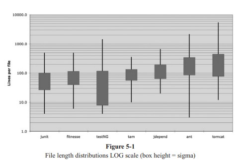
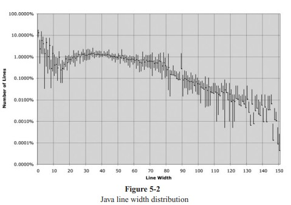

# Chapter 5: Formatting

- [Home](../index.md)
- [Table of Contents](../SUMMARY.md)
- [Chapter 5 index](README.md)

<p align="center">
  
</p>

When someone opens your modules, **orderliness and consistency** signal professionalism. A scrambled file suggests the same carelessness might exist everywhere else.

Formatting is **communication**. Working software changes often; **readability** and style affect every later change. The chapter separates vertical layout (file shape, grouping, call order) from horizontal layout (line length, spacing, alignment, indentation) and ends with **team-wide automated rules**.

## The purpose of formatting

Formatting is important, but not a religion. It exists to help readers understand structure quickly. “Getting it working” is not the whole job - **maintainability and extensibility** inherit the precedents your style sets.

<p align="center">
  
</p>

## Vertical formatting

### How big is a file?

Across projects (JUnit, FitNesse, TestNG, Time and Money, JDepend, Ant, Tomcat), file sizes vary enormously. Many successful systems use **many small files** (often well under 200 lines, rarely over 500). Huge files are possible (Tomcat, Ant) but **small files are usually easier to understand**. Treat “about 200 lines, hard stop near 500” as a **heuristic**, not a law.

### Newspaper metaphor

Read a source file **top to bottom** like a newspaper story:

- The **file or class name** is the headline - it should tell you if you are in the right place.
- The **top** of the file states high-level concepts and algorithms.
- **Detail increases downward** until the lowest-level helpers sit at the bottom.

Many small “articles” (small files) beat one giant undifferentiated blob.

### Vertical openness between concepts

Code is read **left to right and top to bottom**. Each group of lines is a thought; **blank lines** separate thoughts (package, imports, each function). Removing those blanks **obscures** structure even when nothing else changes.

### Listing 5-1 - `BoldWidget.java` (with vertical openness)

```java
package fitnesse.wikitext.widgets;

import java.util.regex.*;

public class BoldWidget extends ParentWidget {
  public static final String REGEXP = "'''.+?'''";
  private static final Pattern pattern = Pattern.compile("'''(.+?)'''",
    Pattern.MULTILINE + Pattern.DOTALL
  );

  public BoldWidget(ParentWidget parent, String text) throws Exception {
    super(parent);
    Matcher match = pattern.matcher(text);
    match.find();
    addChildWidgets(match.group(1));
  }

  public String render() throws Exception {
    StringBuffer html = new StringBuffer("<b>");
    html.append(childHtml()).append("</b>");
    return html.toString();
  }
}
```

### Listing 5-2 - `BoldWidget.java` (blank lines removed)

```java
package fitnesse.wikitext.widgets;
import java.util.regex.*;
public class BoldWidget extends ParentWidget {
  public static final String REGEXP = "'''.+?'''";
  private static final Pattern pattern = Pattern.compile("'''(.+?)'''",
    Pattern.MULTILINE + Pattern.DOTALL);
  public BoldWidget(ParentWidget parent, String text) throws Exception {
    super(parent);
    Matcher match = pattern.matcher(text);
    match.find();
    addChildWidgets(match.group(1));
  }
  public String render() throws Exception {
    StringBuffer html = new StringBuffer("<b>");
    html.append(childHtml()).append("</b>");
    return html.toString();
  }
}
```

### Vertical density

If **openness** separates ideas, **density** binds related lines. Noise comments between two related fields break the “one eye-full” scan.

### Listing 5-3 - `ReporterConfig` (noise breaks density)

```java
public class ReporterConfig {
  /**
   * The class name of the reporter listener
   */
  private String m_className;
  /**
   * The properties of the reporter listener
   */
  private List<Property> m_properties = new ArrayList<Property>();

  public void addProperty(Property property) {
    m_properties.add(property);
  }
}
```

### Listing 5-4 - `ReporterConfig` (dense, related fields together)

```java
public class ReporterConfig {
  private String m_className;
  private List<Property> m_properties = new ArrayList<Property>();

  public void addProperty(Property property) {
    m_properties.add(property);
  }
}
```

### Vertical distance

Readers should not **chase their tails** scrolling a class to see how pieces relate. **Related concepts stay vertically close** (same file when possible; avoid `protected` state that scatters coupling). **Variable declarations** sit as close as practical to use; **locals** at the top of short functions is normal.

```java
private static void readPreferences() {
  InputStream is = null;
  try {
    is = new FileInputStream(getPreferencesFile());
    setPreferences(new Properties(getPreferences()));
    getPreferences().load(is);
  } catch (IOException e) {
    try {
      if (is != null)
        is.close();
    } catch (IOException e1) {
    }
  }
}
```

```java
public int countTestCases() {
  int count = 0;
  for (Test each : tests)
    count += each.countTestCases();
  return count;
}
```

In a **long** function, a variable may be declared just before a loop or block when that improves clarity (TestNG-style):

```java
for (XmlTest test : m_suite.getTests()) {
  TestRunner tr = m_runnerFactory.newTestRunner(this, test);
  tr.addListener(m_textReporter);
  m_testRunners.add(tr);
  invoker = tr.getInvoker();
  for (ITestNGMethod m : tr.getBeforeSuiteMethods()) {
    beforeSuiteMethods.put(m.getMethod(), m);
  }
  for (ITestNGMethod m : tr.getAfterSuiteMethods()) {
    afterSuiteMethods.put(m.getMethod(), m);
  }
}
```

**Instance variables** belong in **one well-known place** (Java convention: top of class). Mid-class instance declarations (JUnit `TestSuite` example, attenuated) force readers to stumble onto state by accident.

```java
public class TestSuite implements Test {
  static public Test createTest(Class<? extends TestCase> theClass, String name) {
    // ...
  }

  public static Constructor<? extends TestCase> getTestConstructor(Class<? extends TestCase> theClass)
    throws NoSuchMethodException {
    // ...
  }

  public static Test warning(final String message) {
    // ...
  }

  private static String exceptionToString(Throwable t) {
    // ...
  }

  private String fName;
  private Vector<Test> fTests = new Vector<Test>(10);

  public TestSuite() {
  }

  public TestSuite(final Class<? extends TestCase> theClass) {
    // ...
  }

  public TestSuite(Class<? extends TestCase> theClass, String name) {
    // ...
  }
}
```

### Dependent functions and conceptual affinity

**Callers above callees** when you can - readers meet a call, then read the definition **below**. Functions that share naming or responsibility (**conceptual affinity**) also belong together even if they do not call each other (JUnit `Assert` overloads).

```java
public class Assert {
  static public void assertTrue(String message, boolean condition) {
    if (!condition)
      fail(message);
  }

  static public void assertTrue(boolean condition) {
    assertTrue(null, condition);
  }

  static public void assertFalse(String message, boolean condition) {
    assertTrue(message, !condition);
  }

  static public void assertFalse(boolean condition) {
    assertFalse(null, condition);
  }
}
```

### Vertical ordering

**Dependencies point down** - high-level first, details last (opposite of older “declare before use” languages that forced unnatural order). Skim the first functions to get the gist without drowning in detail first.

### Listing 5-5 - `WikiPageResponder.java` (caller above callees)

The book uses this FitNesse responder to show **top-down flow**. The structure below matches that intent: `makeResponse` first, helpers beneath. (API details differ across FitNesse versions; this listing follows the chapter’s teaching shape.)

```java
package fitnesse.responders;

import fitnesse.FitNesseContext;
import fitnesse.authentication.SecureResponder;
import fitnesse.http.Request;
import fitnesse.http.Response;
import fitnesse.http.SimpleResponse;
import fitnesse.wiki.PageCrawler;
import fitnesse.wiki.PageData;
import fitnesse.wiki.PathParser;
import fitnesse.wiki.WikiPage;
import fitnesse.wiki.WikiPagePath;

public class WikiPageResponder implements SecureResponder {
  protected WikiPage page;
  protected PageData pageData;
  protected String pageTitle;
  protected Request request;
  protected PageCrawler crawler;

  public Response makeResponse(FitNesseContext context, Request request) throws Exception {
    String pageName = getPageNameOrDefault(request, "FrontPage");
    loadPage(pageName, context);
    if (page == null)
      return notFoundResponse(context, request);
    else
      return makePageResponse(context);
  }

  private String getPageNameOrDefault(Request request, String defaultPageName) {
    String pageName = request.getResource();
    if ("".equals(pageName))
      pageName = defaultPageName;
    return pageName;
  }

  protected void loadPage(String pageName, FitNesseContext context) throws Exception {
    WikiPagePath pagePath = PathParser.parse(pageName);
    crawler = context.getRootPage().getPageCrawler();
    page = crawler.getPage(pagePath);
    if (page != null)
      pageData = page.getData();
  }

  private Response notFoundResponse(FitNesseContext context, Request request) throws Exception {
    return new NotFoundResponder().makeResponse(context, request);
  }

  private Response makePageResponse(FitNesseContext context) throws Exception {
    pageTitle = PathParser.render(page.getPageCrawler().getFullPath(page));
    SimpleResponse response = new SimpleResponse();
    response.setContent(pageData.getHtml());
    return response;
  }
}
```

The `"FrontPage"` literal stays at the level that **knows** the default page name, instead of hiding inside a low-level helper.

<p align="center">
  
</p>

## Horizontal formatting

### Line length

Sampled Java lines cluster around **~45 characters** wide; very long tails exist but are rarer. **Short lines** are easier to scan. The author tolerates edging past **80** toward **100-120**, but not careless 200-character lines or microscopic fonts.

### Horizontal openness and density

**Space around `=`** separates the two major sides of an assignment. **No space** between a function name and `(` keeps “function + arguments” one visual unit. **Spaces after commas** separate arguments.

```java
private void measureLine(String line) {
  lineCount++;
  int lineSize = line.length();
  totalChars += lineSize;
  lineWidthHistogram.addLine(lineSize, lineCount);
  recordWidestLine(lineSize);
}
```

Operator spacing can echo **precedence** in math-heavy code (tighter binding, tighter grouping) - but many auto-formatters flatten those subtleties.

```java
public class Quadratic {
  public static double root1(double a, double b, double c) {
    double determinant = determinant(a, b, c);
    return (-b + Math.sqrt(determinant)) / (2 * a);
  }

  public static double root2(int a, int b, int c) {
    double determinant = determinant(a, b, c);
    return (-b - Math.sqrt(determinant)) / (2 * a);
  }

  private static double determinant(double a, double b, double c) {
    return b * b - 4 * a * c;
  }
}
```

### Horizontal alignment

Column-aligned declarations looked useful in assembly-era habits, but they **emphasize the wrong column** (names without types) and **auto-formatters** undo them. Prefer **unaligned** lists - if alignment “helps,” the real smell is often **too many fields** in one class.

```java
public class FitNesseExpediter implements ResponseSender {
  private Socket           socket;
  private InputStream      input;
  private OutputStream     output;
  private Request          request;
  private Response         response;
  private FitNesseContext  context;
  protected long           requestParsingTimeLimit;
  private long             requestProgress;
  private long             requestParsingDeadline;
  private boolean          hasError;

  public FitNesseExpediter(Socket s,
    FitNesseContext context) throws Exception {
    this.context = context;
    socket = s;
    input = s.getInputStream();
    output = s.getOutputStream();
    requestParsingTimeLimit = 10000;
  }
}
```

```java
public class FitNesseExpediter implements ResponseSender {
  private Socket socket;
  private InputStream input;
  private OutputStream output;
  private Request request;
  private Response response;
  private FitNesseContext context;
  protected long requestParsingTimeLimit;
  private long requestProgress;
  private long requestParsingDeadline;
  private boolean hasError;

  public FitNesseExpediter(Socket s, FitNesseContext context) throws Exception {
    this.context = context;
    socket = s;
    input = s.getInputStream();
    output = s.getOutputStream();
    requestParsingTimeLimit = 10000;
  }
}
```

### Indentation

A file is a **hierarchy** (file, class, method, blocks). **Indentation** makes scope visible so readers can skip irrelevant `if` / `while` bodies and find new methods quickly. Minified one-line classes are **impenetrable** without study.

```java
public class FitNesseServer implements SocketServer {
  private FitNesseContext context;

  public FitNesseServer(FitNesseContext context) {
    this.context = context;
  }

  public void serve(Socket s) {
    serve(s, 10000);
  }

  public void serve(Socket s, long requestTimeout) {
    try {
      FitNesseExpediter sender = new FitNesseExpediter(s, context);
      sender.setRequestParsingTimeLimit(requestTimeout);
      sender.start();
    } catch (Exception e) {
      e.printStackTrace();
    }
  }
}
```

Versus the same logic **without meaningful breaks** (the book’s counter-example):

```java
public class FitNesseServer implements SocketServer { private FitNesseContext context; public FitNesseServer(FitNesseContext context) { this.context = context; } public void serve(Socket s) { serve(s, 10000); } public void serve(Socket s, long requestTimeout) { try { FitNesseExpediter sender = new FitNesseExpediter(s, context); sender.setRequestParsingTimeLimit(requestTimeout); sender.start(); } catch(Exception e) { e.printStackTrace(); } } }
```

### Breaking indentation

Avoid “collapsed” one-line methods for tiny scopes - **expand and indent** so structure stays obvious.

Collapsed (hard to scan):

```java
public class CommentWidget extends TextWidget
{
public static final String REGEXP = "^#[^\r\n]*(?:(?:\r\n)|\n|\r)?";
public CommentWidget(ParentWidget parent, String text){super(parent, text);}
public String render() throws Exception {return ""; }
}
```

Expanded (preferred):

```java
public class CommentWidget extends TextWidget {
  public static final String REGEXP = "^#[^\r\n]*(?:(?:\r\n)|\n|\r)?";

  public CommentWidget(ParentWidget parent, String text) {
    super(parent, text);
  }

  public String render() throws Exception {
    return "";
  }
}
```

### Dummy scopes

When a `while` body is intentionally empty, **indent the lone semicolon** so it is not invisible at line end.

```java
while (dis.read(buf, 0, readBufferSize) != -1)
  ;
```

## Team rules

Agree on **one team style**, encode it in the **IDE formatter**, and follow it. FitNesse picked braces, indent width, and naming in minutes, then automated enforcement. Consistency beats a **jumble of individual styles**.

## Uncle Bob’s formatting rules (example)

The chapter points at **Listing 5-6** as a living style sample - short methods, consistent indentation, readable flow.

### Listing 5-6 - `CodeAnalyzer.java`

```java
import java.io.*;
import java.util.*;

public class CodeAnalyzer implements JavaFileAnalysis {
  private int lineCount;
  private int maxLineWidth;
  private int widestLineNumber;
  private LineWidthHistogram lineWidthHistogram;
  private int totalChars;

  public CodeAnalyzer() {
    lineWidthHistogram = new LineWidthHistogram();
  }

  public static List<File> findJavaFiles(File parentDirectory) {
    List<File> files = new ArrayList<File>();
    findJavaFiles(parentDirectory, files);
    return files;
  }

  private static void findJavaFiles(File parentDirectory, List<File> files) {
    for (File file : parentDirectory.listFiles()) {
      if (file.getName().endsWith(".java"))
        files.add(file);
      else if (file.isDirectory())
        findJavaFiles(file, files);
    }
  }

  public void analyzeFile(File javaFile) throws Exception {
    BufferedReader br = new BufferedReader(new FileReader(javaFile));
    String line;
    while ((line = br.readLine()) != null)
      measureLine(line);
  }

  private void measureLine(String line) {
    lineCount++;
    int lineSize = line.length();
    totalChars += lineSize;
    lineWidthHistogram.addLine(lineSize, lineCount);
    recordWidestLine(lineSize);
  }

  private void recordWidestLine(int lineSize) {
    if (lineSize > maxLineWidth) {
      maxLineWidth = lineSize;
      widestLineNumber = lineCount;
    }
  }

  public int getLineCount() {
    return lineCount;
  }

  public int getMaxLineWidth() {
    return maxLineWidth;
  }

  public int getWidestLineNumber() {
    return widestLineNumber;
  }

  public LineWidthHistogram getLineWidthHistogram() {
    return lineWidthHistogram;
  }

  public double getMeanLineWidth() {
    return (double) totalChars / lineCount;
  }

  public int getMedianLineWidth() {
    Integer[] sortedWidths = getSortedWidths();
    int cumulativeLineCount = 0;
    for (int width : sortedWidths) {
      cumulativeLineCount += lineCountForWidth(width);
      if (cumulativeLineCount > lineCount / 2)
        return width;
    }
    throw new Error("Cannot get here");
  }

  private int lineCountForWidth(int width) {
    return lineWidthHistogram.getLinesforWidth(width).size();
  }

  private Integer[] getSortedWidths() {
    Set<Integer> widths = lineWidthHistogram.getWidths();
    Integer[] sortedWidths = (widths.toArray(new Integer[0]));
    Arrays.sort(sortedWidths);
    return sortedWidths;
  }
}
```

## Takeaway

Formatting is how you **signal structure** to the next reader (often yourself). Vertical layout tells the story; horizontal layout keeps tokens readable; **indentation** reveals scope; **team automation** keeps the signal honest.
