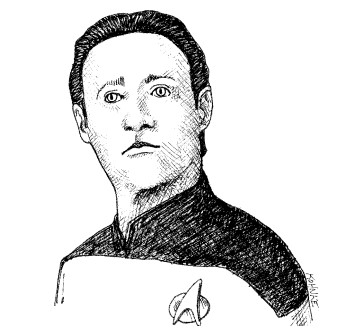

# Chapter 6: Objects and Data Structures

- [Home](../index.md)
- [Table of Contents](../SUMMARY.md)
- [Chapter 6 index](README.md)

<p align="center">
  
</p>

**Private fields** exist so callers do not couple to your representation. You want freedom to change types or storage. **Blind getters and setters** often expose private state as if it were public anyway - they are not abstraction by themselves.

## Data abstraction

Two representations of a Cartesian point show the gap between **leaking implementation** and **hiding it**.

### Listing 6-1 - Concrete `Point`

```java
public class Point {
  public double x;
  public double y;
}
```

### Listing 6-2 - Abstract `Point`

```java
public interface Point {
  double getX();
  double getY();
  void setCartesian(double x, double y);
  double getR();
  double getTheta();
  void setPolar(double r, double theta);
}
```

You cannot tell from Listing 6-2 whether storage is **rectangular, polar, or something else** - yet the type still reads as a clear data abstraction. The methods also encode policy: read coordinates independently, but **set** them through **atomic** updates (`setCartesian` / `setPolar`), not as unrelated mutators to hidden `x`/`y` pairs.

**Hiding implementation** is not "wrap every field in a getter." It is choosing **abstract operations** that express the **meaning** of the data.

### Listing 6-3 - Concrete `Vehicle`

```java
public interface Vehicle {
  double getFuelTankCapacityInGallons();
  double getGallonsOfGasoline();
}
```

### Listing 6-4 - Abstract `Vehicle`

```java
public interface Vehicle {
  double getPercentFuelRemaining();
}
```

(The book prints each snippet as `Vehicle` in isolation; you would not ship **both** `Vehicle` interfaces in one program - they are alternative designs.)

The second form does not reveal whether you track gallons, liters, or a float sensor - it exposes **fuel remaining as a percentage**, which is the idea callers should depend on.

## Data / object anti-symmetry

**Objects** hide data behind abstractions and expose **behavior**. **Data structures** expose data and carry little or no meaningful behavior. The definitions are almost **opposites**, and the tradeoffs are **opposites** too.

### Listing 6-5 - Procedural shape (data structures + `Geometry`)

```java
public class Square {
  public Point topLeft;
  public double side;
}

public class Rectangle {
  public Point topLeft;
  public double height;
  public double width;
}

public class Circle {
  public Point center;
  public double radius;
}

public class Geometry {
  public final double PI = 3.141592653589793;

  public double area(Object shape) throws NoSuchShapeException {
    if (shape instanceof Square) {
      Square s = (Square) shape;
      return s.side * s.side;
    } else if (shape instanceof Rectangle) {
      Rectangle r = (Rectangle) shape;
      return r.height * r.width;
    } else if (shape instanceof Circle) {
      Circle c = (Circle) shape;
      return PI * c.radius * c.radius;
    }
    throw new NoSuchShapeException();
  }
}
```

**Procedural style:** add `perimeter()` in `Geometry` - shape **classes** stay untouched; add a new shape type - **every** function in `Geometry` must grow another branch.

### Listing 6-6 - Polymorphic shapes (objects)

```java
public interface Shape {
  double area();
}

public class Square implements Shape {
  private Point topLeft;
  private double side;

  public double area() {
    return side * side;
  }
}

public class Rectangle implements Shape {
  private Point topLeft;
  private double height;
  private double width;

  public double area() {
    return height * width;
  }
}

public class Circle implements Shape {
  private Point center;
  private double radius;
  public final double PI = 3.141592653589793;

  public double area() {
    return PI * radius * radius;
  }
}
```

**OO style:** add a new shape - existing functions on other shapes stay stable; add a **new operation** across all shapes - **every** class changes (unless you adopt patterns like **Visitor**, which bring their own procedural shape and costs).

**Summary table (from the chapter):**

| Change | Procedural + data structures | Objects + polymorphism |
|--------|------------------------------|-------------------------|
| New function | Easy | Hard (touch all types, or patterns) |
| New type | Hard (touch all functions) | Easy |

**Mature** codebases mix both: objects where you expect **new types**; procedures over simple structures where you expect **new functions**.

## The Law of Demeter

A method on class `C` should only call:

- methods on `C`
- methods on arguments passed to the method
- methods on objects `C` creates inside the method
- methods on objects held in **fields** of `C`

Do not keep calling **through** returned values ("talk to friends, not strangers") when those values are **objects** that should hide structure.

### Train wrecks

```java
final String outputDir = ctxt.getOptions().getScratchDir().getAbsolutePath();
```

Splitting can improve readability:

```java
Options opts = ctxt.getOptions();
File scratchDir = opts.getScratchDir();
final String outputDir = scratchDir.getAbsolutePath();
```

Whether that is a **Demeter violation** depends on whether `ctxt`, `Options`, and `ScratchDir` are **real objects** (hide structure - navigation is suspicious) or **passive data** (public fields or DTO-style - exposure is expected). Accessors blur the picture; pure public-field data would read like:

```java
final String outputDir = ctxt.options.scratchDir.absolutePath;
```

### Hiding structure (tell, do not dig)

If the goal is a buffered output stream for a scratch **file**, ask the owning object to do that work instead of mixing path algebra through the call site:

```java
BufferedOutputStream bos = ctxt.createScratchFileStream(classFileName);
```

That lets `ctxt` **hide** how scratch paths are formed and stops the caller from knowing too much about nested internals.

## Hybrids

Types that are **half object, half data structure** (real behavior **plus** accessors that effectively publish fields) are hard to extend in **both** directions. They usually mean the authors were **unsure** whether they were protecting data from functions or the reverse - **avoid** that muddle.

## Data Transfer Objects (DTOs)

The purest **data structure** form: **public variables**, **no** methods - useful at boundaries (DB rows, socket messages), often one step in translating raw data into domain objects.

### Listing 6-7 - `Address.java` (bean-style DTO)

Beans add private fields with getters/setters; the chapter argues that often gives only **quasi-encapsulation** without a real model.

```java
public class Address {
  private String street;
  private String streetExtra;
  private String city;
  private String state;
  private String zip;

  public Address(String street, String streetExtra,
      String city, String state, String zip) {
    this.street = street;
    this.streetExtra = streetExtra;
    this.city = city;
    this.state = state;
    this.zip = zip;
  }

  public String getStreet() {
    return street;
  }

  public String getStreetExtra() {
    return streetExtra;
  }

  public String getCity() {
    return city;
  }

  public String getState() {
    return state;
  }

  public String getZip() {
    return zip;
  }
}
```

## Active Record

**Active Records** are DTO-like shapes (often mirroring tables) with **navigational** methods such as `save` and `find`. Treat them as **data structures**. Put **business rules** in separate **objects** that hide their internals (often holding Active Record instances privately) instead of bloating the record type into a hybrid.

## Conclusion

- **Objects:** expose behavior, hide data - easier to add **new kinds** of things, harder to add **new cross-cutting operations** without touching many classes.
- **Data structures:** expose data, little behavior - easier to add **new operations** over them, harder to add **new types** without editing each procedure.

Good developers choose **per subproblem**, without assuming that everything must be an object.
