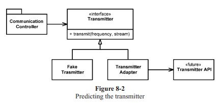

# Chapter 8: Boundaries

- [Home](../index.md)
- [Table of Contents](../SUMMARY.md)
- [Chapter 8 index](README.md)

<p align="center">
  
</p>

You rarely own every line in a system. **Third-party packages**, **open source**, and **other teams** supply pieces you must integrate **without** letting their shapes sprawl through your design. This chapter is about **keeping boundaries clean**: narrow surfaces, learning tests, adapters, and seams where the unknown meets your code.

## Using third-party code

**Providers** want **broad** APIs that work everywhere. **Users** want **small**, focused APIs for their problem. That **tension** shows up at every boundary.

### `java.util.Map` as a wide boundary

`Map` is powerful, but its surface is huge. If you pass a `Map` of sensors around, **any** recipient can call `clear()`, store **any** types, or otherwise break conventions your team thought it had.

**Figure 8-1 - The methods of `Map` (excerpt from the book)**

- `clear()` void - Map  
- `containsKey(Object key)` boolean - Map  
- `containsValue(Object value)` boolean - Map  
- `entrySet()` Set - Map  
- `equals(Object o)` boolean - Map  
- `get(Object key)` Object - Map  
- `getClass()` Class<? extends Object> - Object  
- `hashCode()` int - Map  
- `isEmpty()` boolean - Map  
- `keySet()` Set - Map  
- `notify()` void - Object  
- `notifyAll()` void - Object  
- `put(Object key, Object value)` Object - Map  
- `putAll(Map t)` void - Map  
- `remove(Object key)` Object - Map  
- `size()` int - Map  
- `toString()` String - Object  
- `values()` Collection - Map  
- `wait()` void - Object  
- `wait(long timeout)` void - Object  
- `wait(long timeout, int nanos)` void - Object  

Raw `Map` plus casts at every call site:

```java
Map sensors = new HashMap();
// ...
Sensor s = (Sensor) sensors.get(sensorId);
```

Generics improve readability but **do not** remove extra power you still do not want leaking:

```java
Map<Sensor> sensors = new HashMap<Sensor>();
// ...
Sensor s = sensors.get(sensorId);
```

(The book’s pre-Java-7 style uses `Map<Sensor>` as shorthand for “map of sensors”; in modern Java you would spell key and value types explicitly, e.g. `Map<String, Sensor>`.)

### Hiding `Map` behind an application type

```java
public class Sensors {
  private Map sensors = new HashMap();

  public Sensor getById(String id) {
    return (Sensor) sensors.get(id);
  }
  // snip
}
```

Callers depend on **`Sensors`**, not on **`Map`**. Generics or casting choices become **implementation details** inside one class. You can enforce rules (no `clear`, validated inserts) in **one** place.

You do not need a wrapper for **every** `Map` - you need a rule: **do not let boundary interfaces leak** through public APIs. Keep `Map`, loggers, SDK clients, and similar types **inside** a class or small family of classes.

## Exploring and learning boundaries

Learning a library in production is expensive. **Learning tests** (Jim Newkirk) call the third-party API the way you intend to use it - controlled experiments that capture what you learned and guard against silent vendor drift on upgrades.

### Learning log4j (early experiments)

```java
@Test
public void testLogCreate() {
  Logger logger = Logger.getLogger("MyLogger");
  logger.info("hello");
}
```

```java
@Test
public void testLogAddAppenderWithBareAppender() {
  Logger logger = Logger.getLogger("MyLogger");
  ConsoleAppender appender = new ConsoleAppender();
  logger.addAppender(appender);
  logger.info("hello");
}
```

```java
@Test
public void testLogAddAppenderWithConsoleStream() {
  Logger logger = Logger.getLogger("MyLogger");
  logger.removeAllAppenders();
  logger.addAppender(new ConsoleAppender(
    new PatternLayout("%p %t %m%n"),
    ConsoleAppender.SYSTEM_OUT));
  logger.info("hello");
}
```

### Listing 8-1 - `LogTest.java`

```java
import org.apache.log4j.BasicConfigurator;
import org.apache.log4j.ConsoleAppender;
import org.apache.log4j.Logger;
import org.apache.log4j.PatternLayout;
import org.junit.Before;
import org.junit.Test;

public class LogTest {
  private Logger logger;

  @Before
  public void initialize() {
    logger = Logger.getLogger("logger");
    logger.removeAllAppenders();
    Logger.getRootLogger().removeAllAppenders();
  }

  @Test
  public void basicLogger() {
    BasicConfigurator.configure();
    logger.info("basicLogger");
  }

  @Test
  public void addAppenderWithStream() {
    logger.addAppender(new ConsoleAppender(
      new PatternLayout("%p %t %m%n"),
      ConsoleAppender.SYSTEM_OUT));
    logger.info("addAppenderWithStream");
  }

  @Test
  public void addAppenderWithoutStream() {
    logger.addAppender(new ConsoleAppender(
      new PatternLayout("%p %t %m%n")));
    logger.info("addAppenderWithoutStream");
  }
}
```

That suite **documents** how to get a simple console logger and becomes a **free** safety net on new log4j releases. The production boundary can then hide log4j behind your own logger type.

## Learning tests are better than free

You had to learn the API anyway. Tests make learning **precise** and give a **failing signal** when behavior changes. Even if you skip “learning” mode, **boundary tests** that exercise the vendor the same way production does still pay off during upgrades.

## Using code that does not yet exist

Sometimes the other side of the boundary is **unknown** or not scheduled yet. You can still **define the interface you wish you had**, code the rest of the system against it, and later add an **adapter** when the real API appears.

<p align="center">
  
</p>

**Figure 8-2** (from the book): `CommunicationsController` talks to your **`Transmitter`** abstraction; **`TransmitterAdapter`** translates to the eventual vendor API; **`FakeTransmitter`** supports tests today.

```java
public interface Transmitter {
  void transmit(double frequency, java.io.InputStream data);
}
```

```java
public class TransmitterAdapter implements Transmitter {
  private final Object vendorTransmitterApi;

  public TransmitterAdapter(Object vendorTransmitterApi) {
    this.vendorTransmitterApi = vendorTransmitterApi;
  }

  @Override
  public void transmit(double frequency, java.io.InputStream data) {
    // translate to the real API once it exists
  }
}
```

```java
public class FakeTransmitter implements Transmitter {
  @Override
  public void transmit(double frequency, java.io.InputStream data) {
    // test double: record calls, optionally no-op
  }
}
```

You keep client code **readable** and gain a **seam** for tests while the real subsystem catches up.

## Clean boundaries

Change clusters at boundaries. **Few** places should mention a given vendor type. Prefer **wrappers** (like `Sensors`) or **adapters** (like `TransmitterAdapter`) so your code **speaks in your vocabulary**, usage stays consistent, and upgrades touch **few** files.

Depend on what **you** control - not on whatever a vendor might do next.
