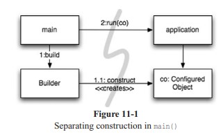
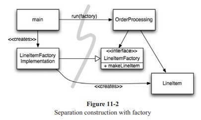
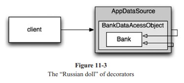

# Chapter 11: Systems

- [Home](../index.md)
- [Table of Contents](../SUMMARY.md)
- [Chapter 11 index](README.md)

<p align="center">
  
</p>

Clean code at **function and class** level is not enough: many systems lack the **separation of concerns** and **layers of abstraction** that make cities work. This chapter is about staying **clean at the system level**—construction vs. use, scaling up, cross-cutting concerns, and keeping **domain logic** visible.

## How would you build a city?

No one person runs every detail; cities work through **teams**, **modularity**, and **abstractions** so people can be effective without seeing the whole map. Software teams are often organized that way, but the **code** does not always follow—this chapter closes that gap.

## Separate constructing a system from using it

**Construction** (building objects, wiring dependencies) is a different process from **runtime use**. Applications should separate **startup** from the logic that runs after startup. That separation is one of the oldest and most important design techniques.

Many applications **do not** separate it: startup is ad hoc and mixed into runtime code. A common idiom is **lazy initialization**:

```java
public Service getService() {
 if (service == null)
 service = new MyServiceImpl(...); // Good enough default for most cases?
 return service;
}
```

**Merits:** pay construction cost only when needed, faster startup, `null` is never returned.

**Problems:** hard-coded dependency on `MyServiceImpl` and everything its constructor needs—you cannot compile without resolving those dependencies even if the object is never used. **Testing** forces test doubles to be installed before the method runs, and you must test **both** the null path and the construction path—**SRP** is violated in a small way. The class also **decides** implementation in a **global** context that may not always be right. One lazy initializer is tolerable; **many** scatter global wiring with little modularity.

**Direction:** modularize construction separately from runtime logic and adopt a **global, consistent** strategy for resolving major dependencies.

## Separation of main

Move **all** construction to `main` (or modules `main` calls) and design the rest of the system as if objects were **already** built and wired. Control flows from `main` into the application; dependency arrows cross the boundary **away** from `main`, so the application does not know how things were constructed.

<p align="center">
  
</p>

**Figure 11-1** — Separating construction in `main()`.

## Factories

Sometimes the **application** must decide **when** to create objects (for example, `LineItem` instances on an `Order`). Use **Abstract Factory** so the app controls timing while **construction details** stay on the `main` side of the line.

<p align="center">
  
</p>

**Figure 11-2** — Separating construction with a factory.

Dependencies still point from `main` toward the application; the app stays decoupled from how `LineItem` is built while controlling **when** instances are created and with what arguments.

## Dependency Injection

**Dependency Injection (DI)** applies **Inversion of Control** to dependency management: objects should not **instantiate** their own dependencies; an **authoritative** mechanism (`main` or a **container**) does. **JNDI** lookups are a **partial** DI—the caller still actively resolves the service:

```java
MyService myService = (MyService)(jndiContext.lookup("NameOfMyService"));
```

**True DI** is more passive: the class exposes **constructors** or **setters** for dependencies; the container creates objects and wires them from **configuration** or a dedicated construction module. **Spring** is the best-known Java example (XML or programmatic wiring). Lazy creation can still exist: many containers construct on demand and support factories or **proxies** for lazy evaluation—treat lazy instantiation as an **optimization**, not a design default.

> **Test doubles:** see **[Mezzaros07]** in the bibliography below.

## Scaling up

Systems grow like settlements → towns → cities: roads and services expand under **real pressure**. It is a myth that software can be gotten **right the first time**; implement today’s stories, then **refactor** and expand—**TDD**, refactoring, and clean code support that at the code level.

At the **system** level, architecture still benefits from **incremental** growth if **separation of concerns** is preserved—software’s malleability makes that possible in ways physical construction does not.

### EJB2 as a cautionary tale

Early **EJB1/EJB2** did not separate concerns well and blocked organic growth. An **Entity Bean** for a `Bank` tied business logic to a **heavyweight container**, required lifecycle boilerplate, made **unit tests** painful (mock the container or deploy to a server), and hurt **reuse** and even **inheritance** between beans. **DTOs** duplicated data shapes and invited copying boilerplate.

**Listing 11-1** — An EJB2 local interface for a Bank EJB

```java
package com.example.banking;
import java.util.Collections;
import javax.ejb.*;
public interface BankLocal extends java.ejb.EJBLocalObject {
 String getStreetAddr1() throws EJBException;
 String getStreetAddr2() throws EJBException;
 String getCity() throws EJBException;
 String getState() throws EJBException;
 String getZipCode() throws EJBException;
 void setStreetAddr1(String street1) throws EJBException;
 void setStreetAddr2(String street2) throws EJBException;
 void setCity(String city) throws EJBException;
 void setState(String state) throws EJBException;
 void setZipCode(String zip) throws EJBException;
 Collection getAccounts() throws EJBException;
 void setAccounts(Collection accounts) throws EJBException;
 void addAccount(AccountDTO accountDTO) throws EJBException;
}
```

**Listing 11-2** — The corresponding EJB2 Entity Bean implementation

```java
package com.example.banking;
import java.util.Collections;
import javax.ejb.*;
public abstract class Bank implements javax.ejb.EntityBean {
 // Business logic...
 public abstract String getStreetAddr1();
 public abstract String getStreetAddr2();
 public abstract String getCity();
 public abstract String getState();
 public abstract String getZipCode();
 public abstract void setStreetAddr1(String street1);
 public abstract void setStreetAddr2(String street2);
 public abstract void setCity(String city);
 public abstract void setState(String state);
 public abstract void setZipCode(String zip);
 public abstract Collection getAccounts();
 public abstract void setAccounts(Collection accounts);
 public void addAccount(AccountDTO accountDTO) {
 InitialContext context = new InitialContext();
 AccountHomeLocal accountHome = context.lookup("AccountHomeLocal");
 AccountLocal account = accountHome.create(accountDTO);
 Collection accounts = getAccounts();
 accounts.add(account);
 }
 // EJB container logic
 public abstract void setId(Integer id);
 public abstract Integer getId();
 public Integer ejbCreate(Integer id) { ... }
 public void ejbPostCreate(Integer id) { ... }
 // The rest had to be implemented but were usually empty:
 public void setEntityContext(EntityContext ctx) {}
 public void unsetEntityContext() {}
 public void ejbActivate() {}
 public void ejbPassivate() {}
 public void ejbLoad() {}
 public void ejbStore() {}
 public void ejbRemove() {}
}
```

(The book also omits the `LocalHome` factory and XML deployment descriptors—those complete the EJB2 picture.)

EJB2 did anticipate **declarative** transaction, security, and persistence in descriptors—**cross-cutting** in spirit.

## Cross-cutting concerns

Persistence, security, and transactions **cut across** natural domain boundaries: you want **one** strategy (one DBMS, naming rules, transaction semantics) applied **everywhere**. The **intersection** of modular persistence with modular domain logic is still awkward—**cross-cutting concerns**.

**Aspect-oriented programming (AOP)** restores modularity: **aspects** declare **where** behavior should attach; the framework applies it **noninvasively** (no hand-editing every call site).

## Java Proxies

JDK **dynamic proxies** suit simple cases (wrap interface methods). They only work with **interfaces**; class proxies need bytecode libraries (**CGLIB**, **ASM**, **Javassist**).

**Listing 11-3** — JDK proxy example

```java
// Bank.java (suppressing package names...)
import java.util.*;
// The abstraction of a bank.
public interface Bank {
 Collection<Account> getAccounts();
 void setAccounts(Collection<Account> accounts);
}
// BankImpl.java
import java.util.*;
// The "Plain Old Java Object" (POJO) implementing the abstraction.
public class BankImpl implements Bank {
 private List<Account> accounts;
 public Collection<Account> getAccounts() {
 return accounts;
 }
 public void setAccounts(Collection<Account> accounts) {
 this.accounts = new ArrayList<Account>();
 for (Account account: accounts) {
 this.accounts.add(account);
 }
 }
}
// BankProxyHandler.java
import java.lang.reflect.*;
import java.util.*;

// "InvocationHandler" required by the proxy API.
public class BankProxyHandler implements InvocationHandler {
 private Bank bank;
 public BankProxyHandler(Bank bank) {
 this.bank = bank;
 }
 // Method defined in InvocationHandler
 public Object invoke(Object proxy, Method method, Object[] args)
 throws Throwable {
 String methodName = method.getName();
 if (methodName.equals("getAccounts")) {
 bank.setAccounts(getAccountsFromDatabase());
 return bank.getAccounts();
 } else if (methodName.equals("setAccounts")) {
 bank.setAccounts((Collection<Account>) args[0]);
 setAccountsToDatabase(bank.getAccounts());
 return null;
 } else {
 ...
 }
 }
 // Lots of details here:
 protected Collection<Account> getAccountsFromDatabase() { ... }
 protected void setAccountsToDatabase(Collection<Account> accounts) { ... }
}
// Somewhere else...
Bank bank = (Bank) Proxy.newProxyInstance(
 Bank.class.getClassLoader(),
 new Class[] { Bank.class },
 new BankProxyHandler(new BankImpl()));
```

Proxies centralize interception but add **volume** and **complexity**; they also lack **system-wide** join-point expression that full AOP provides.

## Pure Java AOP frameworks

**Spring AOP** and **JBoss AOP** hide proxy boilerplate: business code stays in **POJOs**, and **declarative** XML or APIs attach persistence, transactions, security, caching, failover, and so on—often driving the **DI** container that builds the object graph.

**Listing 11-4** — Spring 2.X configuration file (fragment)

```xml
<beans>
 ...
 <bean id="appDataSource"
class="org.apache.commons.dbcp.BasicDataSource"
destroy-method="close"
p:driverClassName="com.mysql.jdbc.Driver"
p:url="jdbc:mysql://localhost:3306/mydb"
p:username="me"/>
 <bean id="bankDataAccessObject"
class="com.example.banking.persistence.BankDataAccessObject"
p:dataSource-ref="appDataSource"/>
 <bean id="bank"
class="com.example.banking.model.Bank"
p:dataAccessObject-ref="bankDataAccessObject"/>
 ...
</beans>
```

The client thinks it calls `getAccounts()` on a `Bank`, but it hits the outermost of nested **Decorator** layers around the POJO—room for transaction, caching, and other decorators.

<p align="center">
  
</p>

**Figure 11-3** — The “Russian doll” of decorators.

```java
XmlBeanFactory bf =
new XmlBeanFactory(new ClassPathResource("app.xml", getClass()));
Bank bank = (Bank) bf.getBean("bank");
```

Few Spring-specific lines keep the application **decoupled** from the framework—contrasting sharply with EJB2 coupling. Verbose XML still expresses **policy** more simply than hand-written proxy graphs; **EJB3** largely followed this declarative, POJO-friendly model (annotations and/or XML).

**Listing 11-5** — An EJB3 Bank EJB (JPA-style)

```java
package com.example.banking.model;
import javax.persistence.*;
import java.util.ArrayList;
import java.util.Collection;
@Entity
@Table(name = "BANKS")
public class Bank implements java.io.Serializable {
 @Id @GeneratedValue(strategy=GenerationType.AUTO)
 private int id;
 @Embeddable // An object "inlined" in Bank's DB row
 public class Address {
 protected String streetAddr1;
 protected String streetAddr2;
 protected String city;
 protected String state;
 protected String zipCode;
 }
 @Embedded
 private Address address;
 @OneToMany(cascade = CascadeType.ALL, fetch = FetchType.EAGER,
 mappedBy="bank")
 private Collection<Account> accounts = new ArrayList<Account>();
 public int getId() {
 return id;
 }
 public void setId(int id) {
 this.id = id;
 }
 public void addAccount(Account account) {
 account.setBank(this);
 accounts.add(account);
 }
 public Collection<Account> getAccounts() {
 return accounts;
 }
 public void setAccounts(Collection<Account> accounts) {
 this.accounts = accounts;
 }
}
```

Mapping can live in annotations or external descriptors—either way the **core** stays far cleaner than EJB2.

## AspectJ aspects

**AspectJ** is the fullest aspect language—rich toolset, adoption cost (tools, language). **Annotation-style** AspectJ and Spring integration lower the bar; Spring/JBoss “pure Java” AOP covers many common cases.

## Test drive the system architecture

If **domain logic** is **POJOs** and infrastructure attaches through **minimal**, aspect-like mechanisms, you can **evolve** architecture from simple to sophisticated and swap technologies **on demand**—without mandatory **BDUF**. BDUF is harmful when it resists change; physical buildings cannot pivot as cheaply—**software physics** still allows radical change when structure separates concerns.

Large sites scale with caching, security, virtualization—enabled by **loose coupling** and simplicity at each level. Teams still need **goals** and **coarse structure**, but must preserve **course correction**.

Over-engineered APIs (early EJB among them) steal focus from user stories; a good framework **disappears** most of the time.

**Recap:** modular **domains of concern** implemented with **POJOs**, integrated with **low-invasive** aspects or similar tools—**architecture can be test-driven** like code.

## Optimize decision making

Modularity enables **decentralized** decisions. Give work to the **most qualified** people—and **postpone** decisions until the last responsible moment so they use the **best information**. Premature decisions are made with **less** customer feedback and implementation learning. POJO systems with separated concerns support **just-in-time**, simpler choices.

## Use standards wisely, when they add demonstrable value

Construction benefits from mature **standards**; software standards ease hiring and reuse—but **slavish** adoption (EJB2 because it was “the standard”) can miss customer value. Standards can lag industry or drift from real needs.

## Systems need domain-specific languages

Mature domains have **vocabulary** and **idioms**. **Domain-Specific Languages (DSLs)**—small languages or fluent APIs—let code read like structured prose a domain expert recognizes, shrinking the gap between **concept** and **implementation** (agile communication parallels). Effective DSLs raise **abstraction** above raw idioms and patterns and let **all** levels be expressed as POJOs where appropriate.

## Bibliography (chapter references)

| Tag | Pointer |
|-----|---------|
| **[Mezzaros07]** | Meszaros, *xUnit Test Patterns* (test doubles / object patterns) |
| **[GOF]** | Gamma et al., *Design Patterns* |
| **[Fowler]** | Fowler, *Patterns of Enterprise Application Architecture* |
| **[Spring]** | Spring Framework documentation / project |
| **[AOSD]** | Aspect-oriented software development references |
| **[AspectJ]** | AspectJ project / language references |
| **[Colyer]** | Colyer et al., *Eclipse AspectJ* |
| **[CGLIB]**, **[ASM]**, **[Javassist]** | Bytecode and proxy libraries |
| **[Goetz]** | Goetz, *Java Concurrency in Practice* (proxy examples context) |
| **[JBoss]** | JBoss AOP / application server materials |
| **[Kolence]** | Kolence on “software physics” |
| **[Alexander]** | Alexander, *A Pattern Language* (influence on patterns community) |
| **[DSL]** | Fowler and others on domain-specific languages |
| **[JMock]** | jMock as Java API DSL example |

## Conclusion

**Systems must be clean.** Invasive architecture **drowns** domain logic, hides bugs, and slows stories—**agility** and **TDD** benefits erode. Keep **intent** clear at every abstraction: **POJOs** for domain truth, **aspect-like** machinery for everything else **noninvasively**. Whether designing systems or modules, prefer the **simplest thing that can possibly work**.
