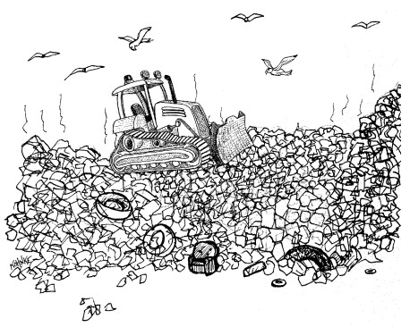

# Chapter 17: Smells and Heuristics

- [Home](../index.md)
- [Table of Contents](../SUMMARY.md)
- [Chapter 17 index](README.md)

  

In *Refactoring*, Martin Fowler catalogued many “code smells.” This chapter expands on that idea with a long, practical list of **smells and heuristics**—rules of thumb learned by refactoring real systems—meant to be read top-to-bottom and also used as a reference.

## Comments

### C1: Inappropriate Information

Comments should not hold information that belongs in other systems (source control, issue tracker, metadata). Change histories and “last modified” markers clutter files and mislead. Use comments for technical notes about code/design.

### C2: Obsolete Comment

Comments rot quickly. Old, irrelevant, or incorrect comments become “floating islands” of misinformation. Update or delete them promptly.

### C3: Redundant Comment

If the code explains itself, the comment adds noise. Javadocs that restate signatures are clutter. Comments should say what code cannot.

### C4: Poorly Written Comment

If a comment is worth writing, it’s worth writing well: clear wording, correct grammar/punctuation, brief, and non-obvious.

### C5: Commented-Out Code

Commented-out code is an abomination: it rots, distracts, and nobody deletes it out of fear. Delete it—source control can always recover it.

## Environment

### E1: Build Requires More Than One Step

Building should be a single trivial operation after checkout. Avoid arcane sequences and missing artifacts scattered around the system.

### E2: Tests Require More Than One Step

Running all unit tests should be one command (or one button). If tests are hard to run, they won’t be run.

## Functions

### F1: Too Many Arguments

Prefer small parameter lists: none, one, two, then three. More than three is suspect; refactor toward objects or clearer decomposition.

### F2: Output Arguments

Output arguments are counterintuitive. If you must change state, change the receiver object’s state rather than using an output parameter.

### F3: Flag Arguments

Boolean flags advertise that a function does more than one thing. Split the function; remove the flag.

### F4: Dead Function

Methods never called should be removed. Don’t fear deletion; source control remembers.

## General

### G1: Multiple Languages in One Source File

Minimize mixing languages (HTML/XML/English/JS/etc.) in one file. It confuses readers and invites sloppiness.

### G2: Obvious Behavior Is Unimplemented

Follow the Principle of Least Surprise. If a name implies behavior (like case-insensitive parsing of “Monday”), implement it. Otherwise readers can’t trust names.

### G3: Incorrect Behavior at the Boundaries

Edge cases defeat intuition. Practice due diligence: identify boundary conditions and write tests for them.

### G4: Overridden Safeties

Overriding safety mechanisms is risky (warnings, failing tests, versioning). “I’ll fix it later” is a trap.

### G5: Duplication

Duplication is a missed abstraction opportunity. Eliminate copy/paste blocks, repeated condition chains, and duplicated algorithms (often via polymorphism or patterns).

### G6: Code at Wrong Level of Abstraction

Keep higher-level concepts separated from lower-level details. Don’t lie or fake semantics to fit a bad abstraction.

### G7: Base Classes Depending on Their Derivatives

Base classes should generally know nothing about derived classes. Coupling base-to-derived harms independent deployment and component evolution.

### G8: Too Much Information

Prefer tight interfaces. Hide data, utility functions, constants, and temporaries to reduce coupling.

### G9: Dead Code

Dead code grows stale and increasingly smelly. Delete it.

### G10: Vertical Separation

Keep definitions close to use: locals just above first use; private functions just below first use.

### G11: Inconsistency

Do similar things similarly. Consistency reduces surprise and cognitive load.

### G12: Clutter

Remove meaningless artifacts: unused variables, unused functions, redundant comments, needless constructors.

### G13: Artificial Coupling

Don’t place constants/enums/helpers in “convenient” but inappropriate locations. Put them where they naturally belong.

### G14: Feature Envy

Methods should be interested in their own class’ data/behavior. If a method reaches deep into another object, consider moving it—unless doing so would violate other design principles.

### G15: Selector Arguments

Dangling booleans/enums used to select behavior are a lazy alternative to multiple well-named functions.

### G16: Obscured Intent

Dense expressions, magic numbers, and cryptic names hide intent. Spend the effort to make code expressive.

### G17: Misplaced Responsibility

Place code where readers expect it. Use naming to reflect true responsibility; avoid “clever” but unintuitive placements.

### G18: Inappropriate Static

Prefer non-static methods unless polymorphism will never be needed and the behavior truly has no owning instance.

### G19: Use Explanatory Variables

Intermediate variables with meaningful names often make code dramatically clearer.

### G20: Function Names Should Say What They Do

Names must communicate units, effects, and mutation/immutability. If you have to read code to understand behavior, rename or redesign.

### G21: Understand the Algorithm

Don’t stop at “passes tests.” Refactor until the algorithm is clear and you genuinely understand why it works.

### G22: Make Logical Dependencies Physical

If a module depends on another’s policy (like page size), express it via explicit API, not an implicit assumption.

### G23: Prefer Polymorphism to If/Else or Switch/Case

Switch statements should be suspect. Use the “one switch” idea: centralize selection and push behavior into polymorphic types.

### G24: Follow Standard Conventions

Teams need consistent conventions; they should be visible in code rather than enforced by argument or documents.

### G25: Replace Magic Numbers with Named Constants

Name non-obvious values. Some numbers are self-explanatory in context, but many are not—and raw constants invite errors.

### G26: Be Precise

Handle nulls, multiple query matches, concurrency, money types, and constraints explicitly. Imprecision usually means disagreement or laziness.

### G27: Structure over Convention

Prefer structures that force correctness over naming conventions that can be ignored.

### G28: Encapsulate Conditionals

Extract boolean logic into well-named functions to clarify intent.

### G29: Avoid Negative Conditionals

Prefer positive forms when possible; they’re easier to understand.

### G30: Functions Should Do One Thing

Split multi-step functions into smaller functions each doing a single, well-named task.

### G31: Hidden Temporal Couplings

Expose ordering constraints by shaping APIs so outputs feed the next step (“bucket brigade”).

### G32: Don’t Be Arbitrary

Arbitrary structure invites arbitrary change. Keep public types where they belong; don’t hide them inside unrelated scopes.

### G33: Encapsulate Boundary Conditions

Centralize +1/-1 logic; don’t scatter boundary adjustments throughout code.

### G34: Functions Should Descend Only One Level of Abstraction

Don’t mix domain intent with low-level syntax concerns. Separating abstraction levels often reveals additional refactorings.

### G35: Keep Configurable Data at High Levels

Defaults and configuration values should be visible where the system is configured, not buried in low-level code.

### G36: Avoid Transitive Navigation

Minimize knowledge of object graphs. Ask immediate collaborators for what you need instead of chaining calls.

## Java

### J1: Avoid Long Import Lists by Using Wildcards

If you use multiple classes from a package, wildcard imports reduce clutter and coupling. Specific imports can be useful for legacy mocking, but are rarely worth the noise.

### J2: Don’t Inherit Constants

Don’t use inheritance to “smuggle” constants via interfaces. Use static imports or proper scoping instead.

### J3: Constants versus Enums

Prefer enums over `public static final int` constants. Enums carry meaning, can host behavior, and make invalid states harder to represent.

## Names

### N1: Choose Descriptive Names

Names are the bulk of readability. Meanings drift; reevaluate names often and keep them descriptive.

### N2: Choose Names at the Appropriate Level of Abstraction

Avoid names that commit to implementation details when the abstraction should remain general.

### N3: Use Standard Nomenclature Where Possible

Use established patterns and conventions (`toString`, decorator naming, ubiquitous language) rather than inventing ad hoc terms.

### N4: Unambiguous Names

Choose names that clearly state what happens. If “doRename” could mean many things, make the intent explicit.

### N5: Use Long Names for Long Scopes

Short names work for tiny scopes; longer scopes demand longer, more precise names.

### N6: Avoid Encodings

Avoid prefix/type encodings (`m_`, subsystem tags). Modern tools already convey scope/type.

### N7: Names Should Describe Side-Effects

If a getter also creates/caches, the name should reveal that behavior.

## Tests

### T1: Insufficient Tests

Tests are insufficient while meaningful conditions remain unexplored or calculations unvalidated.

### T2: Use a Coverage Tool!

Coverage highlights untested branches and lines, making gaps obvious.

### T3: Don’t Skip Trivial Tests

Trivial tests are easy and document behavior; they’re worth it.

### T4: An Ignored Test Is a Question about an Ambiguity

Use ignored/commented tests to capture unclear requirements explicitly.

### T5: Test Boundary Conditions

Boundaries are where bugs live; test them aggressively.

### T6: Exhaustively Test Near Bugs

Bugs cluster. When you find one, expand testing around that area.

### T7: Patterns of Failure Are Revealing

Complete, well-ordered tests can expose patterns that lead to quick diagnosis.

### T8: Test Coverage Patterns Can Be Revealing

What does and doesn’t execute can hint at why certain failures occur.

### T9: Tests Should Be Fast

Slow tests don’t get run. Keep the suite fast so it stays in the loop.

## Conclusion

The list isn’t complete, and it can’t be. The point is the implied **value system**: discipline, clarity, and professionalism. Clean code is not a checklist; it’s a craft practiced through habits and judgment.

